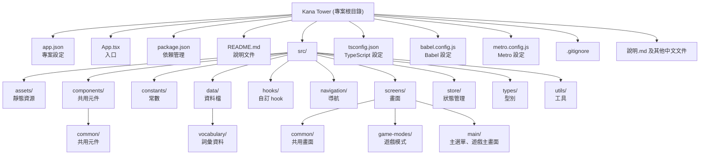

# Kana Tower 專案架構與開發藍圖

---

## 1. 專案架構圖



### 主要目錄說明

- **src/assets/**：圖片、音效、字型等靜態資源
- **src/components/**：可重用的 React 元件（如 ErrorBoundary、Modal、NavBar 等）
- **src/constants/**：遊戲常數、主題設定等
- **src/data/**：遊戲資料、題庫、詞彙等
- **src/hooks/**：自訂 React hook
- **src/navigation/**：App 導航設定
- **src/screens/**：各種畫面（主選單、遊戲模式、設定等）
- **src/store/**：全域狀態管理（如 gameStore）
- **src/types/**：TypeScript 型別定義
- **src/utils/**：工具函式（如日文輸入、轉換等）

---

## 2. 專案 Roadmap（開發藍圖）

### 2.1 目前已完成/現有功能

- 主選單、遊戲主畫面
- 多種遊戲模式（如漢字方塊、長文模式、俄羅斯方塊模式）
- 遊戲資料與題庫管理
- 共用元件（彈窗、導航、錯誤邊界等）
- 狀態管理（如 gameStore）
- 靜態資源管理（圖片、音效）

### 2.2 未來擴充建議

#### 2.2.1 新模式擴充

- 建議將每個遊戲模式獨立於 `src/screens/game-modes/` 目錄下，並將共用邏輯抽離至 `src/components/common/` 或 `src/utils/`
- 新增模式時，建議：
  - 建立新畫面檔案（如 `NewModeScreen.tsx`）
  - 在 `navigation/AppNavigator.tsx` 註冊新路由
  - 若有新資料結構，於 `src/data/` 或 `src/constants/` 新增
  - 共用元件盡量抽象化，利於重用

#### 2.2.2 主題切換（Theme Switching）

- 建議將主題設定集中於 `src/constants/theme.ts`
- 可考慮使用 Context 或 Zustand/MobX 等狀態管理，實現全域主題切換
- UI 元件應盡量依賴主題變數（如顏色、字型），避免硬編碼
- 可預留多主題樣式（如 light/dark/custom）

#### 2.2.3 其他可擴充性

- 多語系支援（i18n）：可於 `src/constants/` 或新增 `src/i18n/` 管理語系檔
- 雲端同步/帳號系統：可於 `src/store/` 或新增 `src/services/` 管理 API
- 成就系統、排行榜等：可於 `src/components/` 與 `src/data/` 擴充

### 2.3 建議開發流程

1. **需求規劃**：明確新功能需求，規劃資料結構與元件劃分
2. **資料設計**：於 `src/data/` 或 `src/constants/` 新增/調整資料
3. **元件開發**：於 `src/components/` 開發可重用元件
4. **畫面開發**：於 `src/screens/` 新增/調整畫面
5. **導航整合**：於 `src/navigation/` 註冊新畫面
6. **狀態管理**：於 `src/store/` 擴充狀態
7. **主題/樣式**：於 `src/constants/theme.ts` 擴充主題
8. **測試與優化**：單元測試、UI 測試、效能優化
9. **文件維護**：於 `README.md`、`說明.md` 等文件補充說明

---

## 3. Roadmap 範例（可直接複製到 README.md）

```markdown
## Roadmap

- [x] 完成主選單與基本遊戲模式
- [x] 完成漢字方塊、長文、俄羅斯方塊模式
- [x] 基本設定與共用元件
- [ ] 新增遊戲模式（如：拼音模式、挑戰模式等）
- [ ] 實作主題切換（Light/Dark/Custom）
- [ ] 多語系支援（繁中、日文、英文）
- [ ] 雲端帳號與同步
- [ ] 成就系統與排行榜
- [ ] UI/UX 優化
- [ ] 單元測試與自動化測試
```

---

如需更細緻的架構圖（如 class diagram、component diagram），或針對某一功能的詳細設計，請再告知！ 

---

## 4. 各遊戲模式詳細說明

### 4.1 漢字模式（Kanji Mode）
- **主要檔案**：`src/screens/game-modes/KanjiModeScreen.tsx`
- **玩法說明**：
  - 顯示一個或多個漢字，玩家需輸入正確的假名讀音（平假名、片假名或混合，依設定而定）。
  - 可設定難度（easy/normal/hard）、JLPT等級、是否顯示意思、提示延遲、顯示筆劃數等。
  - 答對加分並連擊，答錯扣生命，生命歸零遊戲結束。
- **主要資料結構**：
  - `KanjiWord`：包含 kanji、hiragana、katakana、meaning、難度等欄位。
  - `KanjiModeSettings`：控制難度、顯示選項、讀音類型等。
- **擴充建議**：
  - 可增加更多題型（如選擇題、填空題）。
  - 支援自訂題庫、錯題複習。
  - 增加排行榜、成就系統。

### 4.2 長文模式（Long Text Mode）
- **主要檔案**：`src/screens/game-modes/LongTextModeScreen.tsx`
- **玩法說明**：
  - 類似打字練習，顯示一段日文長文，玩家需逐字正確輸入。
  - 支援空格、標點符號、進度顯示、允許回刪等設定。
  - 完成全文可獲得額外獎勵分數。
- **主要資料結構**：
  - `LongTextContent`：包含 content、displayContent、inputContent 等欄位。
  - `LongTextSettings`：控制是否包含空格、標點、長度、型態等。
  - `TextMapping`：用於對應顯示內容與輸入內容的映射。
- **擴充建議**：
  - 增加多段落、主題分類。
  - 支援自訂文章、錯誤統計與複習。
  - 增加時間挑戰、極速模式。

### 4.3 俄羅斯方塊模式（Tetris Mode）
- **主要檔案**：`src/screens/game-modes/TetrisModeScreen.tsx`
- **玩法說明**：
  - 方塊自動下落，每個方塊上有日文單字或漢字，玩家需在方塊落地前輸入正確假名消除方塊。
  - 遊戲包含多種方塊形狀，難度提升時會出現漢字方塊與更長的單字。
  - 支援難度、單字類型（平假名/片假名/混合）設定。
- **主要資料結構**：
  - `TetrisPiece`：包含形狀、單字、假名、座標、顏色、意義等。
  - `TetrisSettings`：控制難度、單字類型等。
  - `tetrisData`：題庫與單字資料。
- **擴充建議**：
  - 增加特殊方塊、技能、道具。
  - 支援多人對戰、排行榜。
  - 增加不同主題皮膚、音效。

--- 